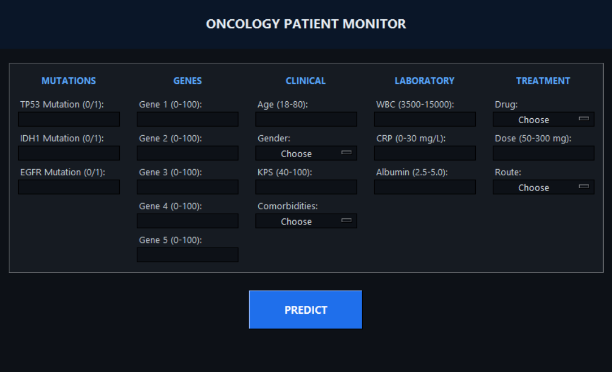
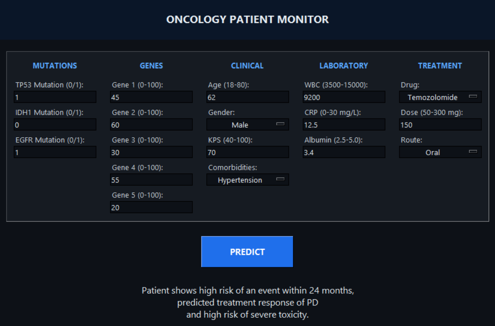

# Oncology Patient Monitor

This project demonstrates the development of a **multi-input, multi-output (MIMO) neural network** that jointly predicts a glioma patient's **survival risk** (binary: event vs. no event within 24 months), **treatment response** (multi-class: CR, PD, PR, SD), and **risk of severe treatment toxicity** (binary) from genomic, clinical, laboratory, and treatment data. A synthetic dataset of 10,000 records was generated, containing genomic markers (TP53/IDH1/EGFR mutation status, 5 gene expression scores), clinical features (age, gender, KPS, comorbidities), laboratory values (WBC, CRP, albumin), and treatment information (drug, dose, route of administration).

Realistic data-quality issues were deliberately injected to simulate a clinical data workflow: extreme outliers in select gene expression values, inconsistent gender label formatting (`Male`, `male`, `MALE`, `M`, ...), missing values in WBC/CRP, and duplicated treatment records. Each of the four input groups is cleaned through its own dedicated `ColumnTransformer` pipeline (median imputation, standard scaling, one-hot/ordinal encoding as appropriate, and IQR-based outlier clipping on the genomic features), then fed into a network with **four parallel input branches** that are concatenated into a shared trunk, followed by three task-specific output heads — one sigmoid (survival), one softmax (treatment response), and one sigmoid (toxicity).

To make the project interactive, a graphical user interface (GUI) was developed using Tkinter. The interface allows users to enter genomic, clinical, laboratory, and treatment values across five labeled panels, and instantly receive all three predictions at once.

Overall, this project demonstrates a complete machine learning workflow, including synthetic data generation, data-quality injection and cleaning, multi-branch preprocessing pipelines, multi-input/multi-output model design and training, evaluation, model persistence, and deployment through a desktop application.

---

## 📁 Project Structure

```
.
├── screenshots/             # GUI screenshots used in this README
├── notebook.ipynb           # Data generation, cleaning, preprocessing, model training & evaluation
├── gui.ipynb                # Tkinter desktop application for making predictions
├── model.joblib             # Saved trained Keras model (generated by notebook.ipynb)
├── genomic_pp.joblib        # Saved preprocessing pipeline — genomic markers
├── clinical_pp.joblib       # Saved preprocessing pipeline — clinical features
├── laboratory_pp.joblib     # Saved preprocessing pipeline — laboratory values
├── treatment_pp.joblib      # Saved preprocessing pipeline — treatment data
├── requirements.txt
├── .gitignore
└── README.md
```

## 🧠 Features

- Synthetic dataset generation (10,000 records) across four data groups:
  * **Genomic**: TP53 / IDH1 / EGFR mutation status, 5 gene expression scores (log2-transformed)
  * **Clinical**: age, gender, Karnofsky Performance Status (KPS), comorbidities
  * **Laboratory**: white blood cell count (WBC), C-reactive protein (CRP), albumin
  * **Treatment**: drug, dose, route of administration (Oral / IV / Intrathecal)
- Three targets engineered from a shared, weighted risk score built out of the underlying features:
  * `event_occured` — survival event within 24 months, derived from a simulated survival time
  * `treatment_response` — RECIST-style category (`CR`, `PD`, `PR`, `SD`) driven by risk score, drug, and dose
  * `severe_toxicity` — thresholded from a simulated toxicity score correlated with risk
- Realistic data-quality issues injected on purpose, then handled during cleaning/preprocessing:
  * Extreme outlier values in 3 of the 5 gene expression columns
  * Inconsistent gender label casing/abbreviations (`male`, `MALE`, `M`, `female`, `FEMALE`, `F`)
  * Missing values in WBC and CRP
  * Duplicated treatment records
- Four separate preprocessing pipelines (`ColumnTransformer`), one per input group:
  * Median imputation + `StandardScaler` for numeric features
  * One-hot encoding for nominal categoricals, ordinal encoding for `Comorbidities`
  * IQR-based clipping of genomic outliers (fit on the training split only)
- **Multi-input, multi-output neural network** built with the Keras Functional API:
  * Four inputs (genomic, clinical, laboratory, treatment), each through its own `Dense(64, relu) → BatchNormalization → Dropout(0.2)` branch
  * Branches concatenated and passed through a shared `Dense(128, relu) → Dropout(0.4)` trunk
  * Output heads: sigmoid (`survival`, event within 24 months), softmax over 4 classes (`response`, treatment response), sigmoid (`toxicity`, severe toxicity risk)
- Compiled with the Adam optimizer, `binary_crossentropy` for the two binary heads and `sparse_categorical_crossentropy` for the response head, with the response loss weighted 2× relative to the others, tracking accuracy on all three heads
- Trained on an 80/20 (train/test) split with an additional 10% validation split, using early stopping on validation loss (`patience = 15`, restoring best weights)
- Trained model and all four preprocessing pipelines persisted with `joblib` for reuse
- Desktop GUI (Tkinter) with five side-by-side panels of labeled entry/dropdown fields, which loads the saved model and pipelines and returns instant predictions for all three targets

## 📊 Model Performance

Evaluated on the held-out test set:

| Task                             | Accuracy | Loss   |
| --------------------------------- | -------- | ------ |
| Survival Event (`survival`)       | 0.886    | 0.252  |
| Treatment Response (`response`)   | 0.882    | 0.321  |
| Severe Toxicity (`toxicity`)      | 0.888    | 0.241  |
| **Total (weighted)**              | —        | **1.134** |

> The total loss is the weighted sum of the three head losses (`response` weighted 2×, `survival` and `toxicity` weighted 1×), as defined by `loss_weights` at compile time.

## 🖥️ GUI Layout

The GUI window ("Oncology Patient Monitor") is split into five panels placed side by side:

- **Mutations**: TP53, IDH1, and EGFR mutation status (0/1)
- **Genes**: Gene 1–5 expression values (0–100)
- **Clinical**: age, gender, KPS, comorbidities
- **Laboratory**: WBC, CRP, albumin
- **Treatment**: drug, dose, route of administration

Clicking **PREDICT** runs the trained model on the entered values and displays the patient's survival risk, predicted treatment response class, and toxicity risk directly in the window.

## 🖥️ Screenshots

| Empty form | Form with prediction |
| --- | --- |
|  |  |

## 🚀 Usage

1. **Train the model** (optional — a pre-trained `model.joblib` and set of `*_pp.joblib` pipelines can be included instead):
   Open and run all cells in `notebook.ipynb`. This will regenerate `model.joblib`, `genomic_pp.joblib`, `clinical_pp.joblib`, `laboratory_pp.joblib`, and `treatment_pp.joblib`.

2. **Run the GUI:** Open `gui.ipynb` and run all cells (or convert it to a `.py` script and run it directly). A window titled "Oncology Patient Monitor" will open where you can enter genomic, clinical, laboratory, and treatment values and click **"PREDICT"** to get all three predictions.

## 🛠️ Tech Stack

- Python 3.x
- numpy
- pandas
- TensorFlow / Keras
- scikit-learn
- joblib
- Tkinter (GUI)

## 📌 Notes

- The dataset used in this project is **synthetically generated** for demonstration purposes and does not reflect real-world clinical or oncology data.
- This project was built as a learning exercise to practice an end-to-end machine learning workflow: data generation → data-quality injection and cleaning → multi-branch preprocessing → multi-input/multi-output model training → evaluation → persistence → deployment.
- Predictions from this tool are statistical estimates only and are **not** a substitute for professional medical diagnosis or clinical decision-making.

## 🎓 About

This project was built as the **final project of a Machine Learning course** at **Uni Brain**, under the instruction of **Mehrshad Eisaei**.
